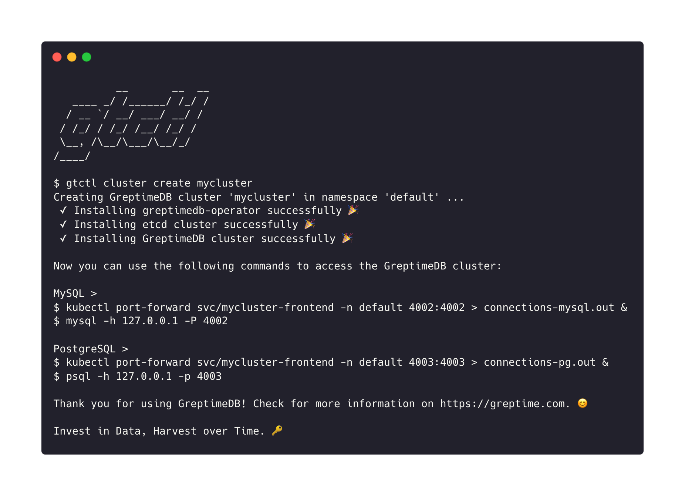

# gtctl

## Overview

gtctl(`g-t-control`) is a command-line tool for managing [GreptimeDB](https://github.com/GrepTimeTeam/greptimedb) cluster. gtctl is the **All-in-One** binary that integrates multiple operations of GreptimeDB cluster.



## Getting Started

### Prerequisites

- **Kubernetes 1.18 or higher version is required**

  You can use [kind](https://kind.sigs.k8s.io/) to create your own Kubernetes cluster:

  ```console
  kind create cluster
  ```

### Quick start

Install your `gtctl` in one line:

```console
curl -L https://raw.githubusercontent.com/greptimeteam/gtctl/develop/hack/install.sh | sh
```

After downloading, your `gtctl` will be in the current directory.

If you want to install the specific version of `gtctl`, you can:

```console
curl -L https://raw.githubusercontent.com/greptimeteam/gtctl/develop/hack/install.sh | sh -s <version>
```

Run `gtctl --help` to get started:

```console
gtctl --help
          __       __  __
   ____ _/ /______/ /_/ /
  / __ `/ __/ ___/ __/ /
 / /_/ / /_/ /__/ /_/ /
 \__, /\__/\___/\__/_/
/____/

gtctl is a command-line tool for managing GreptimeDB cluster.

Usage:
  gtctl [command]

Available Commands:
  cluster     Manage GreptimeDB cluster
  completion  Generate the autocompletion script for the specified shell
  help        Help about any command
  version     Print the version of gtctl and exit

Flags:
  -h, --help      help for gtctl
  -v, --version   version for gtctl

Use "gtctl [command] --help" for more information about a command.
```

Create your own GreptimeDB cluster and etcd cluster:

```console
gtctl cluster create mydb -n default
```

After creating, the whole GreptimeDB cluster will start in `default` namespace:

```console
# Get the cluster.
gtctl cluster get mydb -n default

# List all clusters.
gtctl cluster list
```

You can use `kubectl port-forward` command to forward frontend requests:

```console
kubectl port-forward svc/mydb-frontend 4002:4002 > connections.out &
```

Use your `mysql` client to connect to your cluster:

```console
mysql -h 127.0.0.1 -P 4002
```

If you want to delete the cluster, you can:

```console
# Just delete the cluster.
gtctl cluster delete mydb -n default

# Delete GreptimeDB cluster, including etcd cluster.
gtctl cluster delete mydb -n default --tear-down-etcd
```

### Dry Run Mode

gtctl provides `--dry-run` option in cluster creation. If a user executes the command with `--dry-run`, gtctl will output the manifests content without applying them:

```console
gtctl cluster create mydb -n default --dry-run
```

### Experimental Feature

You can use the following commands to scale (or down-scale) your cluster:

```console
# Scale datanode to 3 replicas.
gtctl cluster scale <your-cluster> -n <your-cluster-namespace> -c datanode --replicas 3

# Scale frontend to 5 replicas.
gtctl cluster scale <your-cluster> -n <your-cluster-namespace> -c frontend --replicas 5
```

### Specify the image registry

`gtctl` uses DockerHub as the default image registry and also supports to specify image registry when creating cluster with `--image-registry` option (the UCloud image registry mirror `uhub.service.ucloud.cn` is now available).

中国用户可使用如下命令创建集群：

```console
gtctl cluster create mydb --image-registry=uhub.service.ucloud.cn
```

## Development

- Compile the project

  ```console
  make
  ```

  Then the `gtctl` will be generated in `bin/`.

## License

gtctl uses the [Apache 2.0 license](./LICENSE) to strike a balance between
open contributions and allowing you to use the software however you want.
